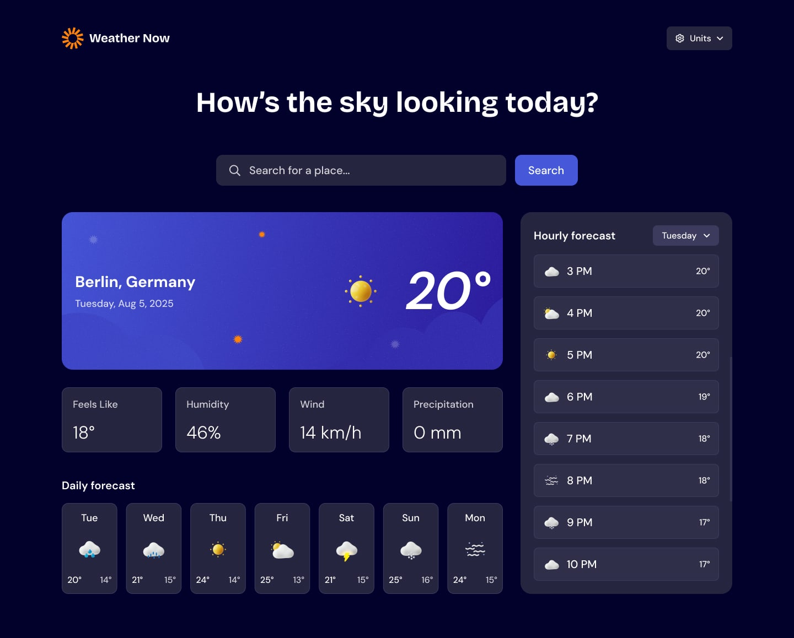

## Proyecto final unidad 1

Este repositorio contiene las actividades de la unidad 2: fundamentos del desarrollo web. en donde se utilizo CSS para dar estilo a la pagina web.

---

## Características

- Uso de clases para el diseño, id para identificar elementos.
- Uso de selectores CSS para aplicar estilos.
- Display: flex para el diseño.
- Display: grid para el diseño.
- Display: inline-block para el diseño.
- Display: block para el diseño.
- Display: inline para el diseño.
- Position: relative para el diseño.
- Position: absolute para el diseño.
- Position: fixed para el diseño.
- Position: sticky para el diseño.
- Diseño responsivo con media queries.
- etc.
---

## Ver proyecto final en linea
Puedes ver el proyecto funcionando aquí:
[Aplicación del tiempo](https://sammy0829322.github.io/3-web-b-fundamentos-desarrollo-web/)

---
Pagina web empleada para la estructura HTML y CSS del proyecto 

## Autor
Samuel Frias Contreras